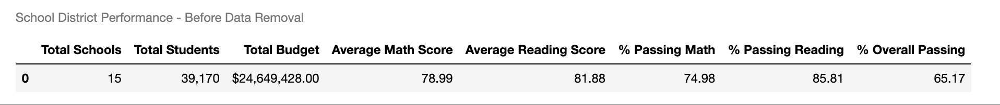
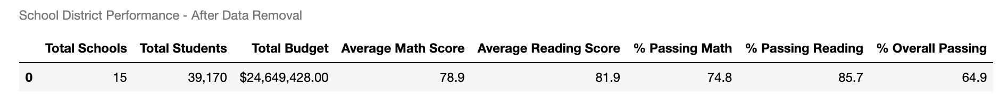
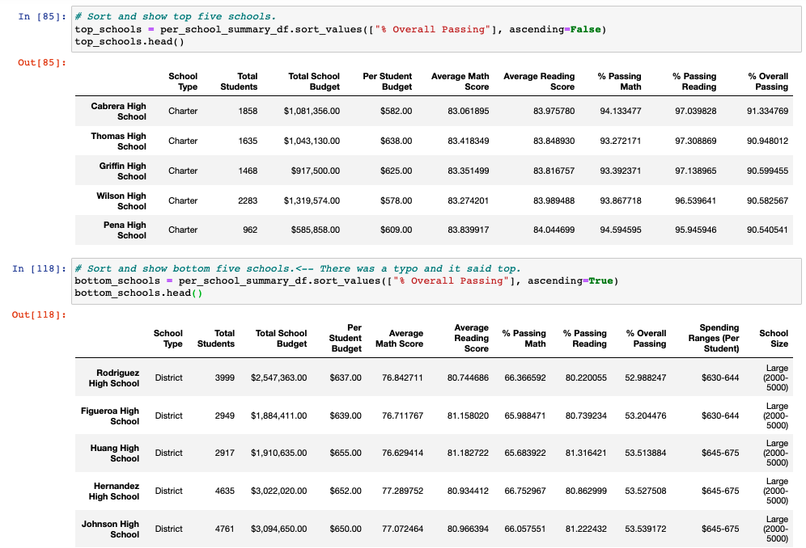
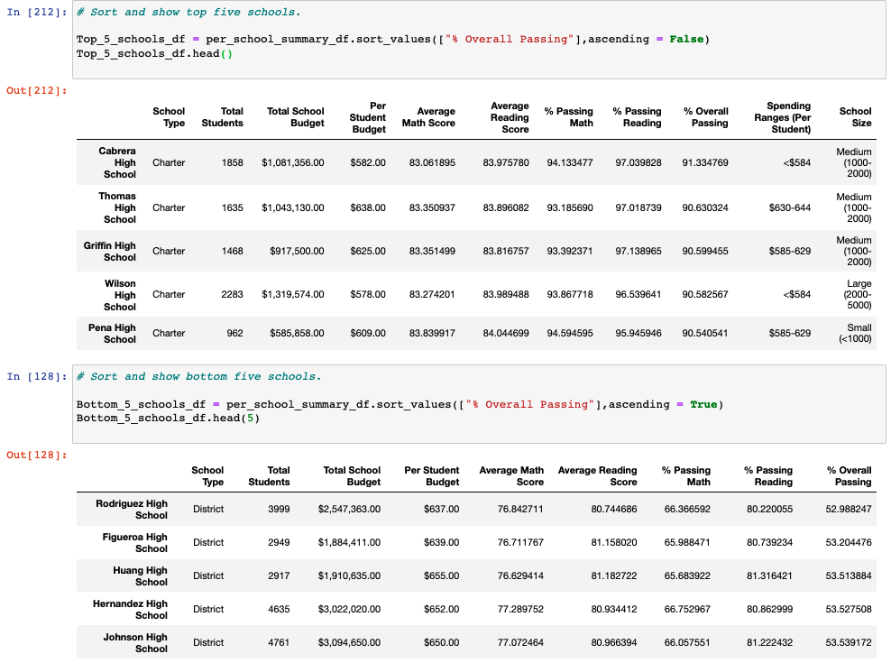

# School_District_Analysis

## Overview 
This analysis outlines the performance of all the high schools in a particular school district. There was suspected cheating in one of the schools (Thomas High School 9th grade class). Therefore, the inital performance results had to be modify in order to disqualify the bad data set. There are 2 Juypter notebooks in this repo one that modify the school district performance data by dropping the bad data and one for before the data was removed. The analysis is mainly focused on the following areas:

- School Type
- Grade Level 
- Size of School
- School Budget Per Student 
- Testing Scores: Reading and Math 

### Jupyter Notebook Links
- [Before Data Removal Analysis](PyCitySchools_Original_Before_Data_Removal)
- [After Data Removal Analysis](PyCitySchools_Challenge.ipynb)

## Results:

- How is the district summary affected?
  - Discard Data Stats: 
    - Thomas High School 9th Grade Count: 461
    - Total School District Student Count - Before Data Removal: 39,170
    - New Total School District Student Count - After Removal of Thomas High School 9th Grade Test Records: 38,709

  - Summary of District Stats: 
    - 
    - 

  - Conclusion:
    - There were minimal impact of the overall Thomas High School 9th grade cheating testing scores being dropped as you can see from the above tables. There was less then a 1% change to the passing test score results. This is probably due to the low number of the number of records dropped aka Thomas High School 9th graders.

- How is the school summary affected?

  - Summary of Top and Bottom 5 School Stats: 
    - [Before Data Removal Analysis](Resources/before-data-removal-summary-school.png)
    - [After Data Removal Analysis](Resources/after-data-removal-summary-school.png)

  - Conclusion:
    - It appears Thomas High School is still within the top 5 school when the 9th grade class data was removed. It only had a 0.30% improvement of oveall passing test data when it was factor in. The 9th grade class seems to be in within normal range of the 10th to 12th grade test data at Thomas High School.

- How does replacing the ninth graders’ math and reading scores affect Thomas High School’s performance relative to the other schools?

  - Summary of Top and Bottom 5 School Stats: 
    - 
    - 

  - Conclusion:
    - It appears Thomas High School is still within the top 5 school when the 9th grade class data was removed. It only had a 0.30% improvement of oveall passing test data when 9th grade data was factor in. The 9th grade class seems to be in within normal range of the 10th to 12th grade test data at Thomas High School. There seems to be very little effect on the other schools rankings. 

