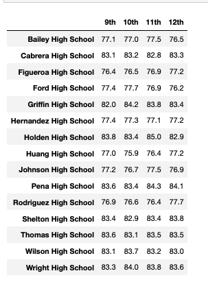
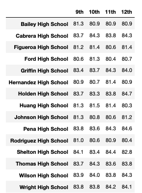
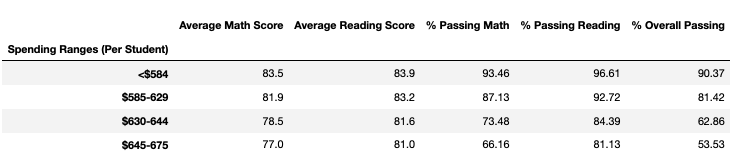
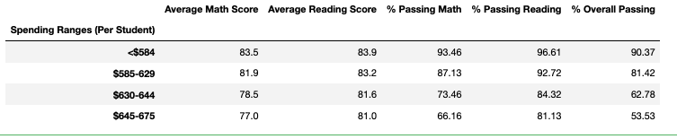
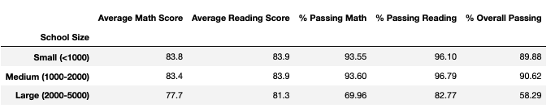
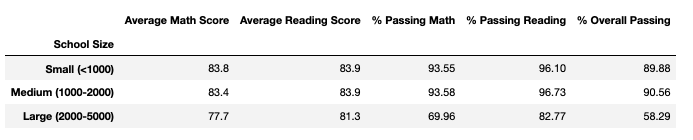
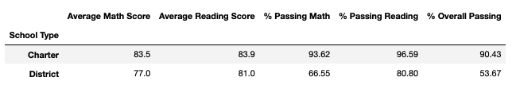
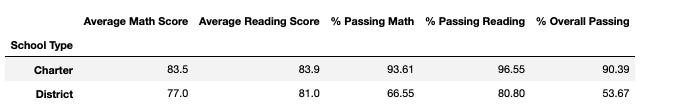

# School_District_Analysis

## Overview 
This analysis outlines the performance of all the high schools in a particular school district. There was suspected cheating in one of the schools (Thomas High School 9th grade class). Therefore, the inital performance results had to be modify in order to disqualify the bad data set. There are 2 Juypter notebooks in this repo one that modify the school district performance data by dropping the bad data and one for before the data was removed. The analysis is mainly focused on the following areas:

- School Type
- Grade Level 
- Size of School
- School Budget Per Student 
- Testing Scores: Reading and Math 

### Jupyter Notebook Links
- [Before Data Removal Analysis](https://github.com/jjcode-databootcamp/School_District_Analysis/blob/main/PyCitySchools_Original_Before_Data_Removal.ipynb)
- [After Data Removal Analysis](https://github.com/jjcode-databootcamp/School_District_Analysis/blob/main/PyCitySchools_Challenge.ipynb)

## Results:

- District and School Metrics Summary: 
  - Discard Data Stats: 
    - Thomas High School 9th Grade Count: 461
    - Total School District Student Count - Before Data Removal: 39,170
    - New Total School District Student Count - After Removal of Thomas High School 9th Grade Test Records: 38,709

  - Summary of District Stats: 
    - 
    - 

-------------------    
  - Summary of Top and Bottom 5 School Stats: 
    - Before Data Removal
      - 
    - After Data Removal 
      - 

  - Findings:
    - There were minimal impact of the overall Thomas High School 9th grade cheating testing scores being dropped as you can see from the above tables. There was less then a 1% change to the passing test score results. This is probably due to the low number of the number of records dropped aka Thomas High School 9th graders who are suspected of cheating.
    
    - It appears Thomas High School is still within the top 5 school when the 9th grade class data was removed. It only had a 0.30% improvement of oveall passing test data when 9th grade data was factor in. The 9th grade class seems to be in within normal range of the 10th to 12th grade test data at Thomas High School. 
    
    - There seems to be very little effect on the other schools rankings. Thomas High School still appears to be rank number 2. Without the 9th grade data Thomas High School "% Overall Passing" only dropped by "0.31%"

    - The following is the 9th grade testing data that was replaced with "nan" for Thomas High School as follows below. The range, average for overall test scores for Thomas High School was not effected by the 9th grade data removal. 
      - Math: 83.6
        - 
      - Reading: 83.7
        - 

    - As for school spending by group it appears there is a slight change in the "$630-644" group which contains "Thomas High School" of "0.08%" for "% Overall Passing"
     - Before: 62.86%
        - 
     - After:  62.78%
        - 

    - As for school size by group it appears there is a slight change in the "Medium (1000-2000)" group which contains "Thomas High School" of "0.06%" for "% Overall Passing"
      - Before: 90.62%
        - 
      - After:  90.56%
        - 

    - As for school school type by group it appears there is a slight change in the "Medium (1000-2000)" group which contains "Thomas High School" of "0.04%" for "% Overall Passing"
      - Before: 90.43%
        - 

      - After:  90.39%
        - 

## Summary
Following changes were observed with the replacements of Thomas High School with NaNs

1. There appears to be a very slight change of dropping the 9th grade data overall for the district 
2. Only the groups that Thomas High School belong to saw any changes.
3. Thomas High School still remains rank number 2 with the 9th grade data dropped
4. Thomas High School is a charter school and overall charter school seems to perform way better then a district school even tho district school spends money per student. The "% Overall Passing" difference between a district and charter school is 36.72%.

